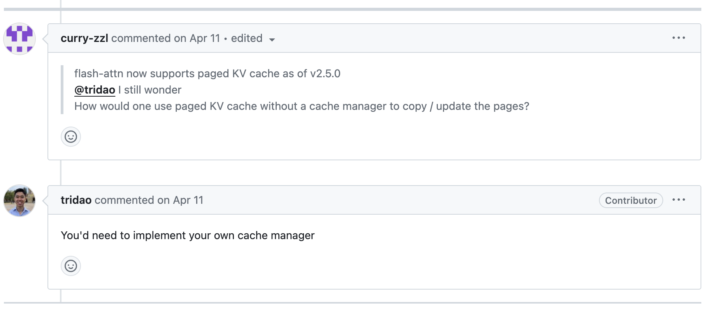

# paged-attention-minimal

A minimal PagedAttention cache manager. `llama3-paged.py` is a <300 line implementation of:
* LLama3 batch inference using ShareGPT prompts (`sharegpt-filtered.json`).
* A KV cache manager for PagedAttention.

This repo aims to show, minimally, 
how PagedAttention achieves larger batch sizes and higher request throughput.

To be clear, this is not a from-scratch implementation of PagedAttention. We'll use Flash Attention's 
PagedAttention kernel, but write our own KV cache manager as 
Tri Dao [suggests](https://github.com/Dao-AILab/flash-attention/issues/660):



## Prereqs

### Llama3 Weights

[Download](https://github.com/meta-llama/llama3?tab=readme-ov-file#download)
the pretrained weights. Here's one way using the command line, after you `pip install huggingface-hub`:

```bash
huggingface-cli download meta-llama/Meta-Llama-3-8B-Instruct --include "original/*" --local-dir Meta-Llama-3-8B-Instruct --token {YOUR_HF_TOKEN}
```

### Dependencies

```bash
pip install torch # cuda required
pip install tiktoken # for the tokenizer
pip install flash-attn --no-build-isolation # for its PagedAttention implementation
```

## Quick Start

### Naive

Generate responses for 4 requests using the naive method
(pre-allocating the full max sequence length of the KV cache for each request):
```bash
python llama3-naive.py 4
```
This will return 4 responses generated using Llama3.

Try increasing the number to see at which batch size OOM occurs. For my setup using a 4090 with memory size 24GB, 
the maximum batch size is 7 (I get an OOM with 8):
```bash
$ python llama3-naive.py 7
...
--------------------------------------------------
Fragmented Memory: 7.23 GB (28.46%)
```
Note how **~30% of the entire GPU memory becomes fragmented and unusable.**
Let's see how using PagedAttention improves this.

### PagedAttention

With PagedAttention, we allocate memory only when we need to when generating tokens. 
**This decreases fragmentation to <1%, and increases maximum batch size by 7X for me:**
```bash
$ python llama3-paged.py 49
...
--------------------------------------------------
Fragmented Memory: 0.14 GB (0.57%)
```

Note that these batch sizes are specific to my setup. If you have more GPU memory available, 
you will be able to use a larger batch size before you OOM.
Regardless, the fact that PagedAttention will allow you to dramatically increase your batch size 
by decreasing memory fragmentation does not change. 
The benefit of PagedAttention will be apparent on any GPU device.

## Fun Details

### PagedAttention

Traditionally, a request's KV cache is 1) stored in contiguous memory space, and 2) pre-allocated with the maximum 
context length (8192 for Llama3). This results in severe internal memory fragmentation e.g. if a request's actual length
was generated to be 792 tokens, ~90% (=7400/8192) of the pre-allocated memory is fragmented i.e. unable to be used by 
any other requests. 

To reduce memory fragmentation and increase request throughput (batch size), PagedAttention offers a non-contiguous 
KV cache memory management scheme, loosely following [OS paging](https://en.wikipedia.org/wiki/Memory_paging). 
This ensures that memory fragmentation only occurs at the last assigned block per request: in the diagram below, 
outlined in red, 3 tokens in Physical Block 3 for request A, and 2 tokens in Physical Block 2 for request B.


I also found it helpful to think about it in code. Instead of this:
```python
y = attn(k_cache=k_cache, v_cache=v_cache, ...)
```
PagedAttention does this:
```python
y = paged_attn(k_cache=k_cache_paged, v_cache=v_cache_paged, block_table=block_table, ...)
```
Unlike `k_cache`, `k_cache_paged` is non-contiguous, and is shared by all requests. Physical blocks 0~8 can be 
assigned to any request, and this is why we pass in `block_table`, which contains the per-request assignments of the 
logical blocks to physical blocks e.g. in the diagram above, `block_table` will look something like 
`{0: [7,1,3], 1: [5,2]}` (0,1 being the indices for request A and B, respectively)

So who makes these assignments?

### KV cache manager

This is what I [reimplement](https://github.com/tspeterkim/paged-attention-minimal/blob/main/llama3-paged.py#L134-L224)
in this repo. I also added a very basic optimization: freeing blocks of finished requests such that the blocks can be 
used by other unfinished requests. Overall, my cache manager focuses on simplicity at the cost of performance.
There are design choices that I made that makes the inference latency scale linearly with the number of requests. 
Shame on me. Please feel free to suggest improvements. In principle, the inference latency should be constant given any
batch size.

To be fair, I made these design choices because it was enough to show the increase in request throughput 
using PagedAttention in <300 lines. If I made the cache manager more performant, I would probably sacrifice the 
minimality. However, it is important to note that performance does matter in the end, and is the reason why 8.5K LOC 
systems like [vLLM](https://github.com/vllm-project/vllm) exist.

## Acknowledgements

Thanks to:
* Meta for the Llama3 [code](https://github.com/meta-llama/llama3) and weights
* @naklecha for the minimal (and entertaining) Llama3 inference [code](https://github.com/naklecha/llama3-from-scratch)
* The authors of the PagedAttention [paper](https://arxiv.org/pdf/2309.06180).
* Tri Dao for the Flash Attention Repo and its PagedAttention [implementation](https://github.com/Dao-AILab/flash-attention).
